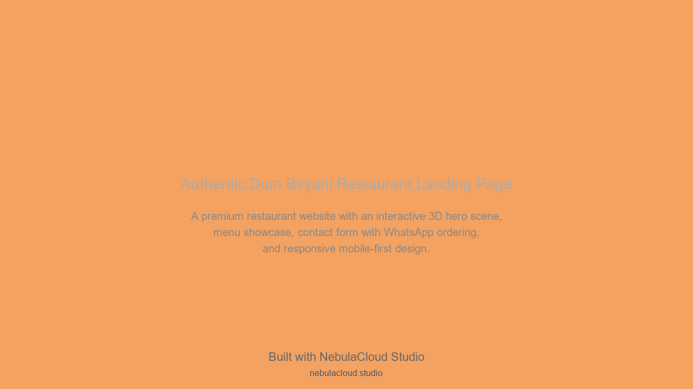

# Royal Biryani — Authentic Dum Biryani Restaurant Landing Page

[](https://studio-public-demos.github.io/royal-biryani/)

**[▶ Open Live Demo](https://studio-public-demos.github.io/royal-biryani/)**

## Overview

Royal Biryani is a premium restaurant landing page for an authentic Hyderabadi dum biryani establishment. The site presents the brand story, a full menu with eight signature biryanis and four side accompaniments, restaurant contact information, and a WhatsApp-based ordering flow.

The application was created using NebulaCloud Studio as a demonstration of how a polished, interactive restaurant website can be built with modern frontend technologies. It features a procedurally generated 3D hero scene, responsive mobile-first design, scroll-triggered animations, and a functional contact-to-WhatsApp ordering pipeline.

## What It Does

| Capability | Description |
|---|---|
| Interactive 3D hero scene | A procedurally animated biryani pot with floating spice particles, rising steam, and drifting clouds — responds to mouse and touch movement for parallax depth |
| Animated loading screen | Progress bar with brand intro that fades to reveal the main content once loaded |
| Scroll-aware navigation bar | Fixed navbar that transitions from transparent to blurred dark background on scroll, with mobile hamburger menu and body scroll lock |
| Menu showcase | Eight biryani items displayed in a responsive grid with spice-level indicators, category badges, descriptions, and pricing |
| Side accompaniments | Four traditional sides presented as interactive cards with hover effects |
| About / heritage section | Brand story with animated stat counters (500K+ served, 27 spices, 60+ years), craft ingredient highlights, and Google rating display |
| Contact with WhatsApp ordering | Contact form that composes a pre-filled WhatsApp message with customer name, phone, and order details — opens WhatsApp directly |
| Quick contact buttons | One-click WhatsApp chat and phone call buttons with restaurant contact details and operating hours |
| Footer with newsletter signup | Brand footer with quick links, social media icons (Instagram, WhatsApp), and email subscription form |
| Back-to-top navigation | Fixed floating button for quick scroll return to hero section |
| Responsive mobile design | Mobile-first CSS with adaptive typography, touch-friendly 48px+ tap targets, mobile hamburger menu, and reduced 3D complexity on mobile devices |

## Why It Matters

This application transforms a restaurant's brand identity into an immersive web experience that works entirely in the browser with no backend required. The interactive 3D hero scene creates immediate visual impact that differentiates the brand from standard restaurant websites.

The WhatsApp-integrated ordering flow removes friction from the customer journey — users browse the menu, fill out a simple form, and are instantly connected to the restaurant's WhatsApp for ordering. This eliminates the need for a full e-commerce backend while providing a practical ordering channel.

For restaurant owners and hospitality marketers, this demonstrates how a fully functional, visually distinctive web presence can be created and deployed as static files hosted on GitHub Pages — requiring no server costs, no database, and no ongoing maintenance beyond content updates to the static data file.

## Intended Users

| Audience | Relevant Application |
|---|---|
| Restaurant owners | Ready-to-customize landing page with menu, contact, and ordering flow |
| Hospitality marketers | Brand-forward web presence with distinctive visual identity |
| Frontend developers | Reference implementation of Three.js + React + TailwindCSS integration |
| Design agencies | Template or starting point for restaurant/hospitality client projects |
| Students and educators | Learning resource for interactive web design, scroll animations, and mobile-first responsive patterns |

## Technical Highlights

| Capability | Technology or Method |
|---|---|
| 3D rendering | Three.js with WebGL2, ACESFilmicToneMapping, PCFSoftShadowMap |
| Procedural 3D geometry | Cylinder, torus, and sphere primitives compose the biryani pot, handles, dough seal, and decorative rings |
| Particle systems | Animated floating spice particles and steam with position, scale, and opacity interpolation |
| Mouse/touch parallax | Input-driven camera and pot movement with smooth lerp-based easing |
| UI framework | React 18 with functional components and hooks |
| Styling | TailwindCSS 3 with custom theme (saffron, golden, dark-spice color palette) |
| Animations | CSS keyframes (float, steam, shimmer), IntersectionObserver-driven reveal animations |
| Responsive design | Mobile-first breakpoints (xs: 475px, sm: 640px, md: 768px, lg: 1024px), adaptive 3D geometry complexity |
| Build tooling | Vite 5 with React plugin |
| Deployment | Static HTML/CSS/JS served via GitHub Pages |
| Fonts | Google Fonts (Playfair Display for headings, Inter for body) |

## Technical Scope and Limitations

- The 3D biryani pot is a procedural illustrative visualization composed of primitive geometries — it is not a photorealistic model or scan of a physical object.
- Steam and particle animations are purely decorative and driven by sinusoidal math — they do not simulate fluid dynamics or thermal behavior.
- The "Add to Order" buttons on menu cards are visual UI elements without cart functionality. Actual ordering flows through the Contact section's WhatsApp form.
- The newsletter signup in the footer is a frontend-only input field without backend storage or email service integration.
- Privacy, Terms, and Careers links in the footer are placeholder hash links without dedicated pages.
- Menu data is hardcoded in a JavaScript module. Modifying menu items requires editing `src/data/menu.js` and rebuilding.
- This is a static frontend application — there is no authentication, database, payment processing, or server-side logic.
- The application is a restaurant landing page and marketing website, not an e-commerce platform or order management system.

## Project Structure

```
royal-biryani/
├── index.html              # Vite entry HTML
├── package.json            # Project dependencies and scripts
├── vite.config.js          # Vite configuration
├── tailwind.config.js      # TailwindCSS theme
├── postcss.config.js       # PostCSS config
├── .gitignore
├── README.md
├── LICENSE
├── ATTRIBUTIONS.md
├── assets/
│   ├── screenshot.png      # Application screenshot
│   └── social-preview.png  # Repository social preview
├── public/
│   └── favicon.svg
└── src/
    ├── main.jsx            # React entry point
    ├── App.jsx             # Root component with loader and section orchestration
    ├── index.css           # TailwindCSS imports and custom component classes
    ├── components/
    │   ├── Loader.jsx      # Animated loading screen with progress bar
    │   ├── Navbar.jsx      # Fixed navigation with scroll detection and mobile menu
    │   ├── Hero.jsx        # Hero section with 3D scene container
    │   ├── Menu.jsx        # Menu grid with biryani cards and sides
    │   ├── About.jsx       # Heritage section with stats and craft details
    │   ├── Contact.jsx     # Contact info, WhatsApp form, quick order buttons
    │   └── Footer.jsx      # Footer with links, social icons, newsletter
    ├── three/
    │   └── BiryaniScene.js # Three.js scene: pot, particles, steam, clouds, lighting
    └── data/
        └── menu.js         # Menu items, side items, and restaurant info data
```

## Quick Start

```bash
git clone https://github.com/studio-public-demos/royal-biryani.git
cd royal-biryani
npm install
npm run dev
```

Then open http://localhost:5173 in your browser.

To build for production:

```bash
npm run build
```

The production build is output to the `dist/` directory and can be served with any static file server:

```bash
python -m http.server 8080 --directory dist
```

## Deployment

This project is deployed using GitHub Pages from the `main` branch, serving the contents of the `dist/` directory.

**Live demo:** [https://studio-public-demos.github.io/royal-biryani/](https://studio-public-demos.github.io/royal-biryani/)

## Attribution

All 3D content is procedurally generated. Fonts are loaded from Google Fonts (SIL Open Font License). See [ATTRIBUTIONS.md](ATTRIBUTIONS.md) for complete library and asset attributions.

## Built with NebulaCloud Studio

This project was created using [NebulaCloud Studio](https://nebulacloud.studio), an agentic application-building platform for engineering, scientific, geospatial and interactive digital workflows.

NebulaCloud Studio helps domain professionals turn ideas, models, datasets and algorithms into usable, deployable applications.

## Build Your Own Restaurant Website

Running a restaurant, cafe, or food business and want an interactive online presence?

Explore the live demo and see how your brand could be transformed into an immersive web experience.

**[Explore NebulaCloud Studio](https://nebulacloud.studio)**

## Related Demos

- [Sponza Atrium WebGL Viewer](https://github.com/studio-public-demos/sponza-webgl) — Real-time 3D architectural visualization
- [Drone Simulator Pro](https://github.com/studio-public-demos/drone-simulator-pro) — Interactive UAV flight simulation
- [Earthquake Globe Explorer](https://github.com/studio-public-demos/earthquake-globe) — 3D geospatial data visualization
- [Car CFD Viewer](https://github.com/studio-public-demos/car-cfd-viewer) — Computational fluid dynamics visualization
- [Hotel Financial Dashboard](https://github.com/studio-public-demos/hotel-dashboard) — Interactive hospitality analytics
